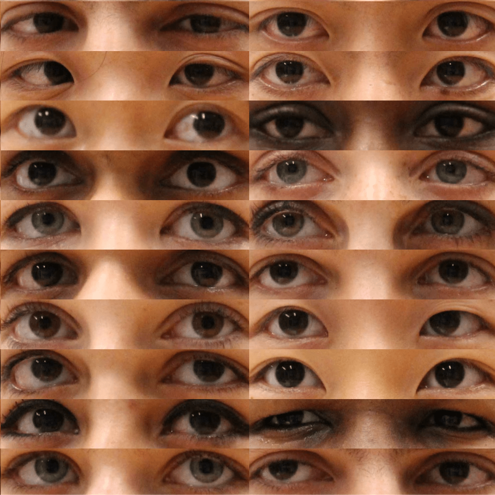

# eyes-follow-mouse

<!-- same mage but max height 500px -->

    

### Dataset Citation:
"Gaze Locking: Passive Eye Contact Detection for Human?Object Interaction,"
 
B.A. Smith, Q. Yin, S.K. Feiner and S.K. Nayar,
 
ACM Symposium on User Interface Software and Technology (UIST),
 
pp. 271-280, Oct. 2013.
 

https://www.cs.columbia.edu/CAVE/databases/columbia_gaze/